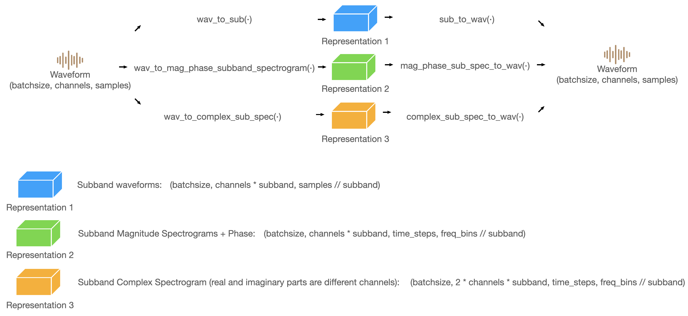

# torchsubband

This's a package for subband decomposition. 

It can transform waveform into three kinds of subband feature representations. 



## Reconstruction loss

The following table shows the reconstruction quality. We tried a set of audio to conduct subband decomposition and reconstruction.


| Subbands |  L1loss   | PESQ  | SiSDR|
| :----: | :----: | :----: | :----:
| 2 | 1e-6  | 4.64 | 61.8 |
| 4 | 1e-6  | 4.64 | 58.9 |
| 8 | 5e-5  | 4.64 | 58.2 |

You can also test this program by training the following test script. It will give you some evaluation output.

```python
from torchsubband import test
test()
```

## Usage

```python
from torchsubband import SubbandDSP
import torch

model = SubbandDSP(subband=2)
batchsize=3
channel=1
length = 44100*2
input = torch.randn((batchsize,channel,length))

# Get subband waveform
subwav = model.wav_to_sub(input)
reconstruct_1 = model.sub_to_wav(subwav,length=length)

# Get subband magnitude spectrogram
sub_spec,cos,sin = model.wav_to_spectrogram_phase(input)
reconstruct_2 = model.spectrogram_phase_to_wav(sub_spec,cos,sin,length=length)

# Get subband complex spectrogram
sub_complex_spec = model.wav_to_complex_sub_spec(input)
reconstruct_3 = model.complex_sub_spec_to_wav(sub_complex_spec,length=length)
```
